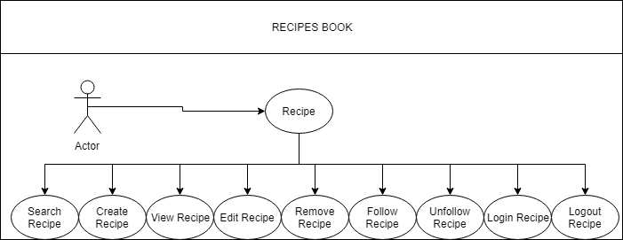
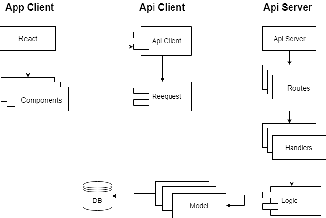

# Recipes book

A web app to share your favorite recipes with your friends and find diferents recipes around the world

## Functional Description

## Show Functional

[Recipe-book demo](http://recipe-book.surge.sh)

## Tecnical Description

### Data Model

### Block Model

## Tecnologies

- HTML
- CSS
- BOOTSTRAP
- Mocha
- React 
- Node
- Moongose
- Heroku
- Surge

## Planing Description

## Developer

* Carlos Ramos (https://github.com/Asix94)